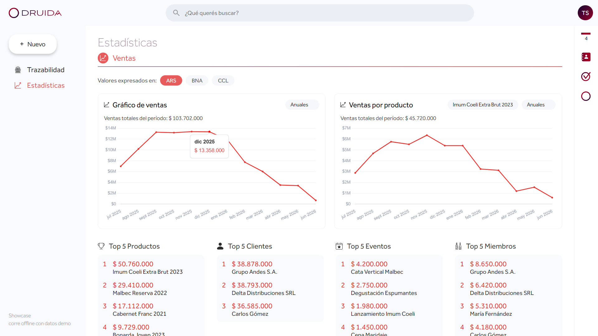
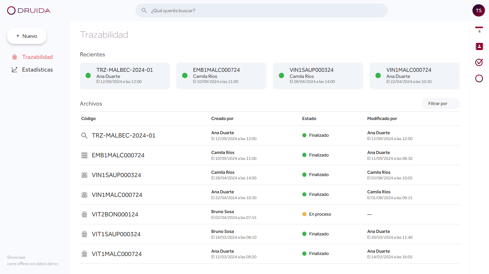
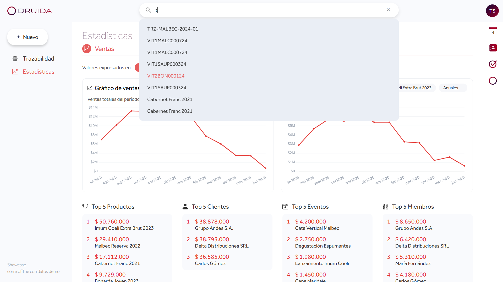

# Druida — Wine Industry ERP

> A vertical platform built end-to-end for a boutique winery. Traceability, BI dashboards, global search and an AI agent — from grape to bottle.



**Live showcase**: `npm run dev` (runs fully offline, no credentials needed)
**Companion storefront**: [fincalosastros.com.ar](https://fincalosastros.com.ar)
**Portfolio**: [tomassitta.com](https://tomasrodrigositta.web.app)

---

## About this repository

This repo is a **curated showcase** of selected modules from Druida — focused on the parts I consider most technically interesting. The full production codebase is private, as Druida is the operational software of Finca Los Astros, a winery startup I'm a partner in.

The showcase runs fully offline against demo fixtures (no Firebase, no credentials). The modules are self-contained and immediately runnable:

```bash
npm install
npm run dev   # → http://localhost:5173
```

---

## What Druida is

Druida is a **vertical SaaS** designed specifically for boutique wineries. Most ERPs are horizontal — generic tools adapted to whatever industry uses them. Druida is the opposite: every module is built around how a winery actually operates, from grape to bottle.

The system covers the full operational cycle:

- **End-to-end traceability** — each wine batch tracked through four stages (viticulture → vinification → bottling → label), with immutable history at every transition.
- **ERP modules** — clients, sales, purchases, inventory, multi-warehouse stock management.
- **AI agent** — an internal assistant built for the team. Employees query operational data in natural language and the agent returns structured answers grounded in real Firestore data.
- **BI dashboards** — multi-currency conversion (ARS / BNA / CCL), top-5 products / clients / events, sales trends over time.
- **Events and experience layer** — events, tastings, demonstrations and digital library, all tied to the member system.
- **Storefront integration** — paired with Finca Los Astros, a member-only ecommerce storefront.
- **Mercado Pago integration** — full checkout flow with order state tracking.

The project didn't start as an ERP. It started as a single-purpose tool — tracking a wine from grape to label — and grew into a full platform as the team's operational needs surfaced. Each module was added in response to a real, specific problem raised by the people running the business.

---

## About Finca Los Astros

Finca Los Astros is a winery startup in Godoy Cruz, Mendoza (Argentina), currently in its first planting season. It's a family business — the founders are my uncles — and I came in as the partner responsible for the entire technology stack.

The product they had in mind from day one was unusual for a winery: not just wine, but the experience around it. Members are admitted by invitation through a waiting list, with strict yearly renewal rules and access to events, tastings, demonstrations and avant-premieres of new vintages. Wine is never sold through retail — only through this private circle.

That model created software requirements that no off-the-shelf ERP handles well: strict member quotas, waiting list management, mandatory first purchase within 30 days of admission, annual renewal logic, integrated event reservations, and full traceability from the moment a grape is picked to the moment a bottle reaches a member. The founders trusted me to build it from scratch, and the scope grew naturally — what started as a traceability tool became the operational backbone of the company.

---

## Featured modules

### 1. Wine traceability — `src/modules/trazabilidad/`

The most distinctive module in the system. Each wine batch is tracked through a four-stage chain:

```
VITICULTURE → VINIFICATION → BOTTLING → TRACEABILITY ROLLUP
```

Key technical choices:

- **Self-describing composite IDs** — every document gets a human-readable code instead of an opaque UUID: `VIT1MALC000724` decodes as *Viticulture · own land · Malbec · Cuartel · lot 7 · 2024*. Field workers can read a lot on sight; codes group and sort naturally. The encoding rules live as pure functions in [`loteCode.js`](src/modules/trazabilidad/loteCode.js).
- **State as a function of data** — a document is `finalizado` only when every required field is filled. `deriveState()` walks the document recursively so the status can never drift out of sync — no flag to forget to flip. Ported from the Flask backend to keep the rule set as the single source of truth.
- **Natural sort** — composite codes must order the way humans expect (lot 2 before lot 10, not lexically). [`naturalSort.js`](src/modules/trazabilidad/naturalSort.js) splits each id into letter/number chunks and compares them piecewise.
- **Chain reconstruction** — a traceability rollup stores only references. [`chain.js`](src/modules/trazabilidad/chain.js) walks them to rebuild the full story (*bottling → vinification batches → origin vineyard lots*), surfaced as tabs in the detail view ([`DocDetail.jsx`](src/modules/trazabilidad/DocDetail.jsx)).

📁 Key files: `loteCode.js` · `naturalSort.js` · `chain.js` · `Trazabilidad.jsx` · `DocDetail.jsx`

---

### 2. Global fuzzy search — `src/modules/busqueda/`

A single search bar in the top header that searches **across 9 heterogeneous Firestore collections** (clients, wine lots, sales, purchases, stock, events…) and routes each result to the correct detail view.

Key technical choices:

- **Client-side indexing with Fuse.js** — pre-loads a denormalized index on app load, avoiding multiple Firestore calls per keystroke.
- **Heterogeneous schema normalization** — instead of guessing fields from `Object.keys(firstDoc)`, each collection declares how to project a document into a common `{ id, collection, label, subtitle, date }` record in [`searchRecords.js`](src/modules/busqueda/searchRecords.js). Adding a collection is one entry in a map.
- **Weighted fields** — `label` and `id` are weighted higher than `subtitle` so a name match outranks an incidental substring.
- **~100 LoC** — [`HeaderSearch.jsx`](src/modules/busqueda/HeaderSearch.jsx) + [`searchRecords.js`](src/modules/busqueda/searchRecords.js), easy to read end-to-end.

📁 Key files: `HeaderSearch.jsx` · `searchRecords.js`

---

### 3. Sales analytics — `src/modules/estadisticas/`

Druida's BI dashboard: multi-currency toggle (ARS / BNA / CCL), two Chart.js revenue lines (overall and per-product, monthly or daily), and four ranked Top 5 lists (products, clients, events, members).

Key technical choices:

- **Pure aggregation layer** — all the maths (`monthlyRevenue`, `dailyRevenue`, `topProductos`, `topClientes`, `topEventos`, `topMiembros`) lives in [`analytics.js`](src/modules/estadisticas/analytics.js), isolated from rendering. The component is pure presentation; the reducers are unit-testable without React in the room.
- **Schema-faithful demo data** — [`src/demo/fixtures/ventas.js`](src/demo/fixtures/ventas.js) generates ~14 months of sales with a seasonal curve and a weighted product/client mix, producing organic-looking charts and rankings. The shape is identical to production Firestore documents so the aggregation logic runs unchanged.
- **Single data seam** — [`src/services/dataService.js`](src/services/dataService.js) is the only place the app touches data. Flip `DEMO_MODE` and everything runs against fixtures; keep it off and the same code hits Firestore. No `if (demo)` leaks into UI components.

📁 Key files: `analytics.js` · `Estadisticas.jsx` · `src/demo/`

---

### 4. Conversational data agent — `agent/`

The backend behind Druida's in-app assistant: a **Gemini agent that answers natural-language questions about the winery by calling read-only Firestore tools**.

Ask *"¿cuál fue la venta más cara este mes?"* and it picks the right tool, queries Firestore, and answers grounded in real data. Ask *"¿de qué suelo viene el Cabernet Franc 2023?"* and it chains five tool calls — wine → traceability → bottling → vinification → viticulture.

Key technical choices:

- **Function calling loop** — deliberately simple: `while response.function_calls: handle_tool_call(...)`. Gemini decides which tools to call and in what order; the backend just executes them.
- **16 typed query tools** — each function takes typed arguments (`contar`, `campo_a_extraer`, date filters, etc.) and returns JSON. Gemini reads the signatures to decide how to call them.
- **Multi-hop chains** — the system prompt teaches the model to chain tool calls across collections. Tracing a finished wine back to its grape's soil type requires five consecutive calls across five collections.
- **Persistent threads** — each conversation is stored in Firestore (`historial_chat`). History is loaded into the Gemini chat session on first message; a short title is generated once per thread with a lighter model (`gemini-2.5-flash`).

This is the **real production code**, tidied and scrubbed of secrets. The live demo above doesn't wire up the chat UI — it needs a live Gemini key and Firestore — so this folder is here to read. See the [agent walkthrough](agent/README.md) for a deeper tour.

📁 Key files: `agent/agent.py` · `agent/README.md`

---

## Stack

| Layer | Technology |
|---|---|
| Frontend | React 19 · Vite |
| Backend | Python · Flask |
| Database | Firebase (Firestore) |
| AI | Gemini API (`gemini-2.5-pro`) |
| Search | Fuse.js (client-side fuzzy search) |
| Charts | Chart.js |
| Payments | Mercado Pago |
| Hosting | Firebase Hosting |

---

## Screenshots

| Traceability | Search | Analytics |
|---|---|---|
|  |  |  |

---

## Running locally

```bash
git clone https://github.com/tomsnxw/druida-showcase
cd druida-showcase
npm install
npm run dev   # → http://localhost:5173
```

Runs fully offline against demo fixtures — no Firebase credentials, no API keys, no backend needed.

To read the agent backend code: see [`agent/README.md`](agent/README.md). Running it requires a Gemini API key and a Firestore service account.

---

## Project status

Druida is hosted and operational, currently used by the Finca Los Astros team to set up workflows ahead of the winery's first production season. Built solely by me as the partner responsible for the technology stack.

---

## Author

**Tomás Rodrigo Sitta**
AI Product Builder · Full-Stack Developer · Designer

[LinkedIn](https://linkedin.com/in/tomas-sitta) · [Portfolio](https://tomasrodrigositta.web.app) · [Behance](https://behance.net/tomsrsitta) · [Email](mailto:410toms@gmail.com)

---

## License

MIT — see [LICENSE](./LICENSE) for details. The showcase code is open for reading and learning; the full production codebase remains private.
